# todo_list_app

# Demo

https://user-images.githubusercontent.com/70806734/136070580-c00cb2d8-78bb-4051-acdc-fbeb2779882e.mp4

# Screen Shots

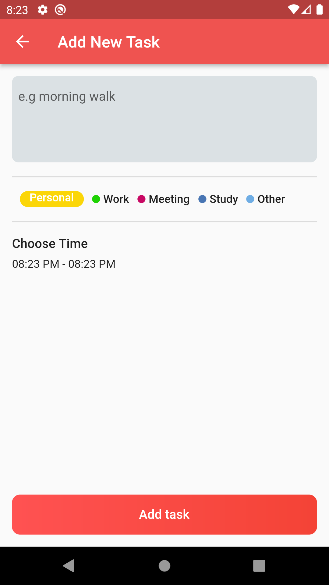
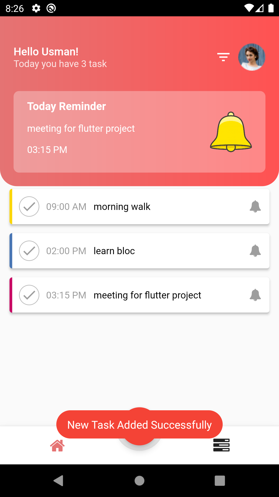

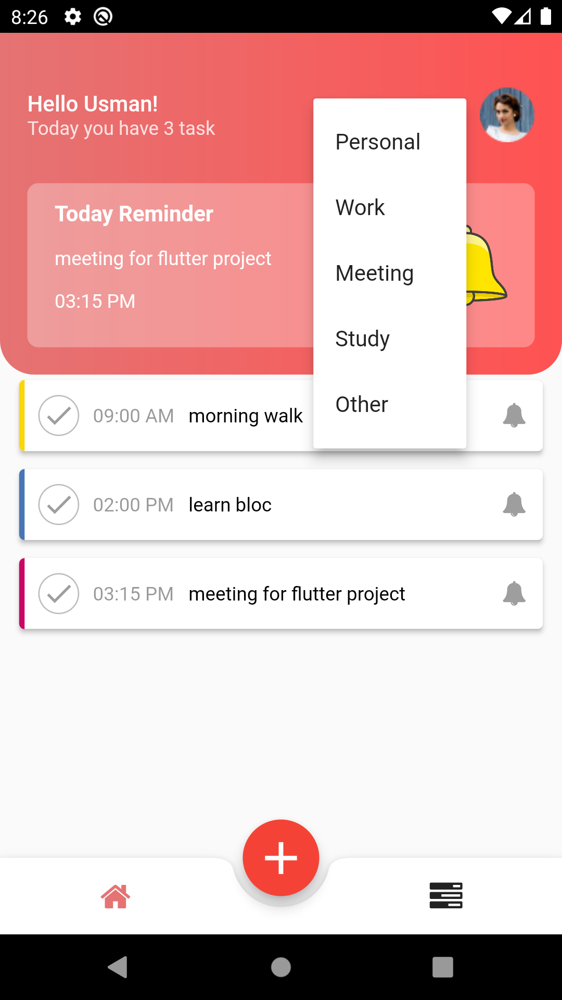
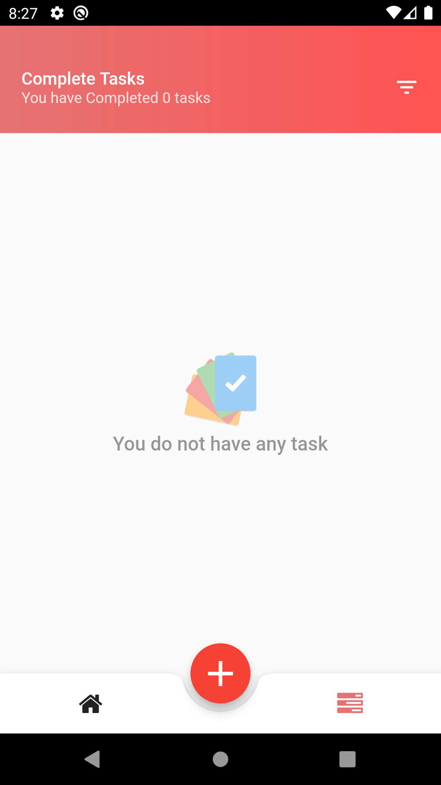
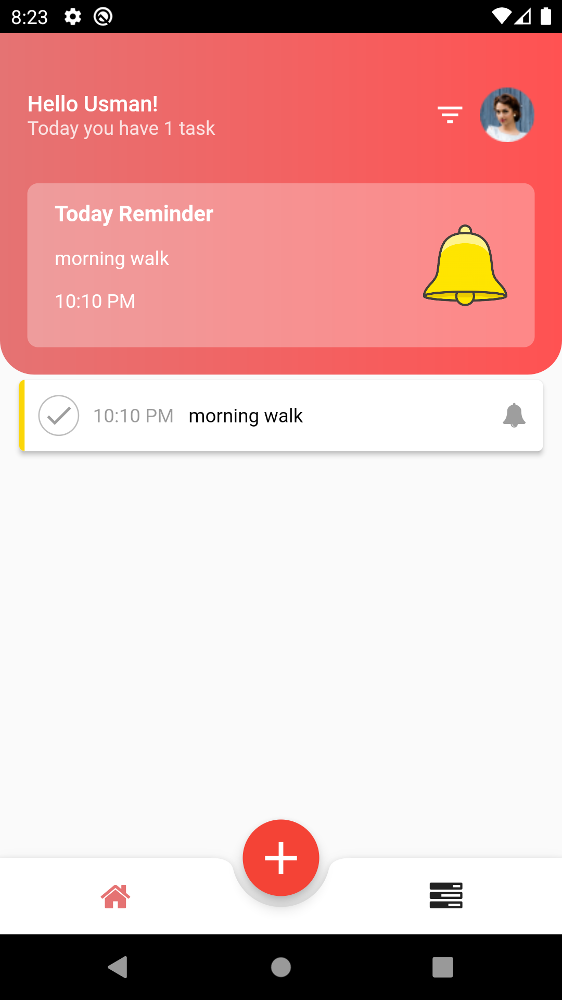

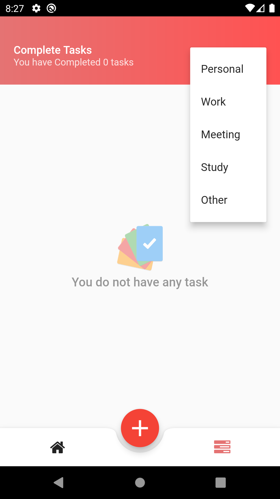
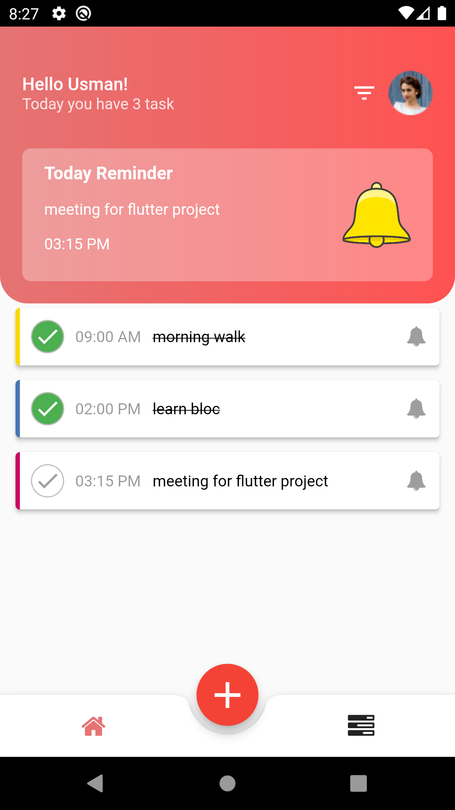
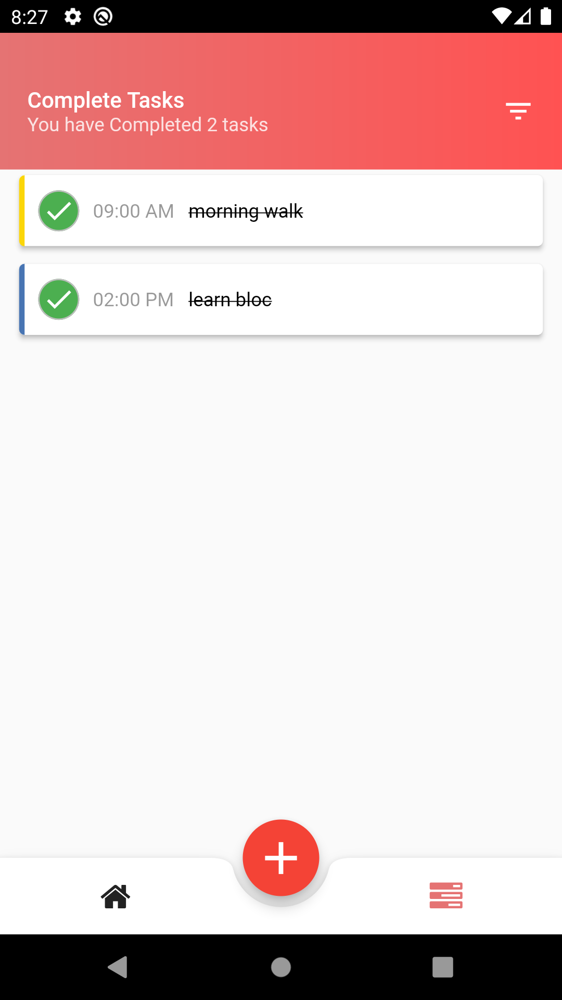

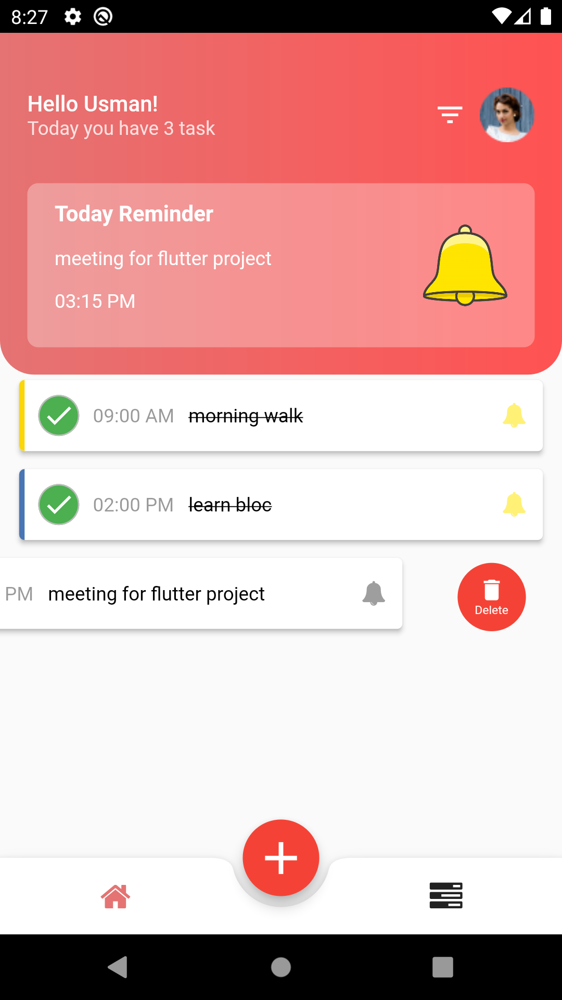
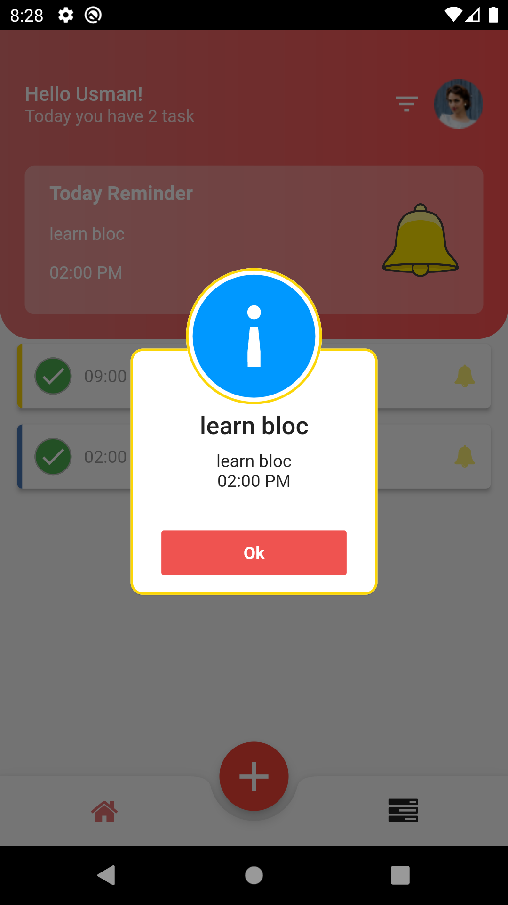
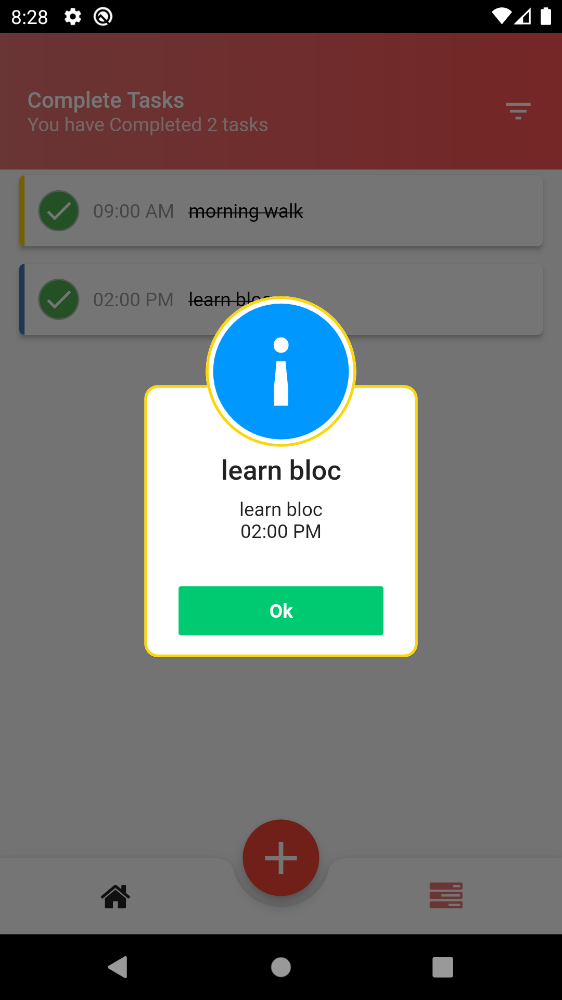

  

## 1) Home Page

## 2) Add New Task Page

## 3) SuccessFully Added Task

## 4) Filters Option on Home Page

## 5) Filters Option Personal Selected

## 6) Completed Task Page

## 7) Filters Option on Completed Task Page

## 8) Task Checked

## 9) Task Completed

## 10) Delete Task

## 11) Animated Popup on Home Page

## 12) Animated Popup on Task Complete Page

